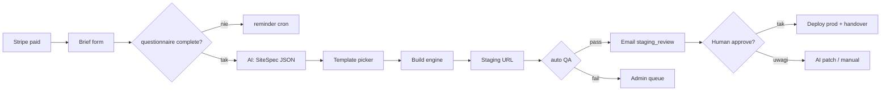

# Automatyzacja delivery — od briefu do stagingu

**Pytanie:** czy po zakupie projekt może iść do klienta automatem — gotowe motywy w repo, AI z briefu, deploy?

**Odpowiedź:** **tak, tierowo** — Landing/Start da się zautomatyzować w 80–90%; Sklep Pro zawsze wymaga human QA; integracje/migracje = pół-auto.

**Stan repo dziś:** `webhook → worker → buildBriefMarkdown → PDF email` — **nie** buduje strony WP.

---

## Co już masz (nie zaczynaj od zera)

```
Stripe paid
  → serviceOrders.status = FILLED
  → kickoffGenerate() / processPendingJobs()
  → buildPersonalizedDocument()  ← lib/project-brief-generator.ts
  → deliverProjectBrief() PDF
  → [CZŁOWIEK] SOP 7–14 dni
```

**Rozszerzasz worker o krok `BUILD_SITE`**, nie przepisujesz checkoutu.

---

## Docelowy pipeline



---

## Warstwa 1 — Repo szablonów (nie 317 stron, ~12 presetów)

**Nie trzymaj** 317 gotowych stron w repo. Trzymaj **12–15 presetów** × wariant pakietu:

```
templates/
  wordpress/
    landing/
      restauracja/     # child theme + content.xml + theme.json colors
      dentysta/
      uslugi-lokal/
      b2b/
    start/             # + podstrony O nas, Usługi, Kontakt
      ...
    sklep-woo/         # WooCommerce + P24 stub + 10 demo products
      moda/
      food/
  shopify/             # theme zip + settings JSON (backlog)
  static/              # opcjonalnie Astro/Next landing ultra-light
```

Każdy preset = **manifest**:

```json
{
  "id": "wp-landing-restauracja",
  "branch": "restauracja",
  "packageTier": ["landing", "waas-landing"],
  "parentTheme": "astra",
  "childTheme": "so-restauracja",
  "contentImport": "content/restauracja.xml",
  "requiredBriefFields": ["nazwaFirmy", "branza", "emailKontakt"],
  "aiSlots": ["hero.headline", "hero.subline", "about.text", "services[]", "contact.phone"]
}
```

**Źródło prawdy kolorów/branż:** `content/wykonane-mocki.json` — już masz gradient, accent, fake copy per branża.

**Sync z:** `SZABLONY-WP-BIBLIOTEKA.md` — child themes `so-{branch}`.

---

## Warstwa 2 — AI: brief → SiteSpec (JSON, nie HTML)

**Input:** `questionnaireData` + slug pakietu + kategoria  
**Output:** `SiteSpec` — strukturalny, walidowany Zod:

```typescript
type SiteSpec = {
  templateId: string;           // wp-landing-restauracja
  brand: { name: string; tagline: string; colors: { primary: string; accent: string } };
  pages: { slug: string; sections: Section[] }[];
  seo: { title: string; description: string };
  integrations: { ga4?: boolean; formEmail: string; mapAddress?: string };
  assets: { logoUrl?: string; photos?: string[]; useStock: boolean };
  locale: "pl";
};
```

**Prompt (OpenRouter — masz już env):**
1. Klasyfikuj branżę → `templateId`
2. Wypełnij sloty tekstowe po polsku (tone: COPY-TONE-OF-VOICE.md)
3. Jeśli brak treści → `useStock: true` + wygeneruj placeholder
4. **Nigdy** nie generuj PHP/kodu — tylko JSON

**Cache:** zapis `siteSpec` w DB obok `resultMarkdown`.

**Koszt:** ~2–5k tokenów / projekt ≈ grosze na DeepSeek.

---

## Warstwa 3 — Build engine (serce automatyzacji)

Osobny moduł `lib/site-builder/` — **nie** w Next.js request cycle.

### Opcja A — WordPress (rekomendowana na start)

| Krok | Narzędzie |
|------|-----------|
| Provision | Docker Compose per klient **lub** WP multisite subdomain |
| Install WP | WP-CLI `core install` |
| Motyw | copy child theme + `theme mod` / CSS variables z SiteSpec |
| Treści | WP-CLI `wp post create` + import XML **lub** custom JSON→Gutenberg blocks |
| Pluginy | pinned lista z SZABLONY-WP (Rank Math, Fluent Forms, cache) |
| SSL | Traefik / Caddy wildcard `*.clients.stronyodzaraz.pl` |
| Output | `https://{orderId}.clients.stronyodzaraz.pl` |

**Runner:** Coolify scheduled job **lub** osobny worker container z Docker socket (ostrożnie — sandbox).

```bash
# pseudocode
wp site-builder run \
  --spec=./specs/{orderId}.json \
  --template=wp-landing-restauracja \
  --url={orderId}.clients.stronyodzaraz.pl
```

### Opcja B — Static / Next (tylko ultra-landing)

- Preset = folder `templates/static/restauracja/`
- AI wypełnia `content.json`
- `npm run build` → deploy na Coolify per subdomain
- **Plus:** szybko, tanio, CWV  
- **Minus:** klient nie edytuje WP — gorsze dla upsell opieki

### Opcja C — Hybrid (productized sweet spot)

| Pakiet | Auto build |
|--------|------------|
| Landing 1490 | Static **lub** WP landing preset |
| Start 2490 | WP Start preset |
| Pro 4990 | WP + **human** 2h polish |
| Sklep | WP Woo preset + CSV produktów z briefu |
| WaaS | auto staging → po akceptacji → subskrypcja na tym samym VPS |

---

## Warstwa 4 — Schema DB (rozszerzenie)

Nowe statusy `ServiceOrder`:

```
PENDING → PAID → FILLED → SPEC_READY → BUILDING → STAGING → REVIEW → DELIVERED
                              ↓              ↓
                           FAILED         QA_FAILED
```

Nowe kolumny:

| Kolumna | Typ |
|---------|-----|
| `siteSpec` | jsonb |
| `templateId` | text |
| `stagingUrl` | text |
| `productionUrl` | text |
| `buildAttempts` | int |
| `buildLog` | text |
| `qaReport` | jsonb |
| `approvedAt` | timestamp |
| `approvedBy` | enum auto / client / admin |

---

## Warstwa 5 — Auto QA (blokada wysyłki gówna)

Przed `staging_review` email — Playwright cron:

| Check | Fail action |
|-------|-------------|
| HTTP 200 homepage | retry build |
| SSL valid | alert admin |
| Formularz POST test | QA_FAILED |
| Mobile viewport screenshot | opcjonalnie AI vision |
| Lighthouse perf >70 | warn, nie blokuj Landing |
| Brak ``lorem ipsum`` jeśli klient dał treści | warn |
| Linki 404 | fail |

**Human gate:** email staging → klient ma 5 dni → dopiero potem `approvedAt` → deploy prod.

**Landing tier opcjonalnie:** auto-approve po QA pass + regulamin „akceptacja automatyczna po 24h” — ryzykowne, lepiej zawsze mail.

---

## Warstwa 6 — Assety (logo, zdjęcia)

| Źródło | Auto |
|--------|------|
| Link Google Drive w briefie | webhook fetch + resize (sharp) — **backlog** |
| Brak logo | generuj monogram SVG z inicjałów (CSS, nie AI image) |
| Brak zdjęć | Unsplash API per branża (licencja) |
| AI image | Gemini brief — **nie** na critical path |

---

## Realistyczny rollout (fazy)

### Faza 0 — Teraz (0 kodu build)
- Brief PDF ✅
- Człowiek + SZABLONY-WP-BIBLIOTEKA

### Faza 1 — MVP auto (4–6 tyg.)
- 3 presety: `landing/restauracja`, `landing-uslugi`, `start-b2b`
- `SiteSpec` generator (OpenRouter)
- WP-CLI builder script (manual trigger `./scripts/build-site.ts {orderId}`)
- Staging subdomain ręcznie w Coolify
- **Cel:** 1 landing w 15 min po briefie zamiast 3h

### Faza 2 — Worker integration (2–3 tyg.)
- Cron `process` → po `questionnaireData` complete → BUILDING
- Auto QA Playwright
- Email `staging_review` auto
- Admin panel `/admin/orders/{id}` — log, retry, approve

### Faza 3 — Sklep + WaaS (1–2 mc)
- Woo preset + CSV parser z briefu
- Stripe subscription bind po DELIVERED
- Template picker AI z 8 branżami

### Faza 4 — Full productized (ciągłe)
- 12 presetów
- Klient edytuje w WP — już działa
- 80% Landing bez dotykania
- 50% Start z 30 min human QA
- Sklep Pro zawsze human

---

## Co NIE automatyzuj (albo klient będzie narzekał)

- Domena klienta DNS — pół-auto (instrukcja + check DNS cron)
- P24 **produkcja** — wymaga weryfikacji merchant ID klienta
- Copy „kreatywne” bez briefu — AI placeholder OK, ale ustaw expectation
- Migracja starych URL — osobny pipeline
- Shopify/Shoper — inne API niż WP; faza 3+

---

## Architektura repo (propozycja)

```
stronyodzaraz/          # sklep Next (już jest)
packages/
  site-builder/         # CLI + WP-CLI wrapper
  site-spec/            # Zod schemas + AI prompt
templates/              # presety WP/static
  wordpress/landing/restauracja/
scripts/
  build-site.ts
  qa-site.ts
```

**Alternatywa:** osobne repo `stronyodzaraz-templates` — CI buduje Docker image z presetami, sklep tylko triggeruje API.

---

## API trigger (minimal)

```
POST /api/internal/build-site
Authorization: Bearer CRON_SECRET
Body: { orderId: "uuid" }

→ load questionnaireData
→ generate SiteSpec (AI)
→ queue build job
→ update status BUILDING
```

Webhook po build OK:
```
→ status STAGING
→ sendStagingReviewEmail
```

---

## Ekonomia

| Model | Koszt COGS | Twój czas |
|-------|------------|-----------|
| Manual Landing | ~0 PLN | 3–5h |
| Auto Landing | ~2 PLN AI + hosting | 15 min QA |
| Auto Start | ~5 PLN | 30–60 min |
| Sklep auto | ~10 PLN | 2–4h human |

**Marża:** przy 1490 Landing i 15 min QA — unit economics się zgadza (patrz UNIT-ECONOMICS.md).

**Limit:** równoległe buildy — queue max 3 (Docker RAM). Reszta czeka w FIFO.

---

## Decyzje do podjęcia

| # | Pytanie | Rekomendacja |
|---|---------|--------------|
| 1 | WP vs static na Landing | WP — upsell opieki |
| 2 | Multisite vs Docker per klient | Multisite na start (tańsze), Docker na WaaS Sklep |
| 3 | 100% auto na Landing? | Nie — zawsze QA screenshot + opcjonalnie human approve |
| 4 | AI generuje layout? | **Nie** — tylko wybór preset + copy w slotach |
| 5 | Repo templates w monorepo? | Tak na MVP, split później |

---

**Następny krok kod (jeśli idziesz w to):** patrz [DELIVERY-STACK-MASTER.md](./DELIVERY-STACK-MASTER.md) — pełny stack z researchu.

1. `lib/site-spec/schema.ts` + prompt — [DELIVERY-STACK-AI-QA.md](./DELIVERY-STACK-AI-QA.md)
2. `templates/wordpress/landing/restauracja/` — [DELIVERY-STACK-WORDPRESS.md](./DELIVERY-STACK-WORDPRESS.md)
3. `scripts/build-site.mjs` + Docker — [DELIVERY-STACK-INFRA.md](./DELIVERY-STACK-INFRA.md)
4. Rozszerz `worker.ts`: po `questionnaireData` → generate spec
5. Statusy w `schema.ts` + migracja

**Alternatywa MVP:** InstaWP API — [DELIVERY-STACK-MASTER.md § Build engine](./DELIVERY-STACK-MASTER.md)

---

*Stack: DELIVERY-STACK-*.md · Powiązane: BOILERPLATE.md · worker.ts · project-brief-generator.ts · PROCES-REALIZACJI-SOP.md · SZABLONY-WP-BIBLIOTEKA.md · COOLIFY-JOBS.md*
