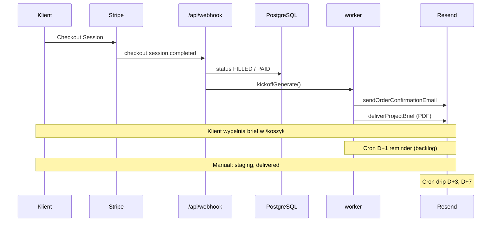

# Transakcje Stripe → e-maile — pełny flow

**Od kliknięcia „Zapłać” do protokołu odbioru.**

---

## Diagram

---

## Faza 1 — Płatność (T+0)

| Krok | System | Email |
|------|--------|-------|
| 1 | Klient kończy Stripe Checkout | — |
| 2 | Webhook `checkout.session.completed` | — |
| 3 | `handleUslugaPaid` / `handleKoszykPaid` | — |
| 4 | DB: `PENDING` → `FILLED`, zapis email, payment_id | — |
| 5 | `kickoffGenerate(orderId)` | — |
| 6 | Worker: generacja briefu markdown | — |
| 7 | `sendOrderConfirmationEmail` | **Potwierdzenie zamówienia** |
| 8 | `deliverProjectBrief` | **Brief PDF/DOCX** |

**Szablony:** `checkout_confirmation` + brief (kod) · `content/TRESCI-EMAILS.json`

**Stripe metadata:** `serviceOrderId`, `serviceOrderIds` (koszyk)

---

## Faza 2 — Brief (T+0 … T+48h)

| Czas | Warunek | Email | Implementacja |
|------|---------|-------|---------------|
| T+24h | brief niekompletny | `brief_reminder_d1` | ❌ cron process |
| T+48h | brak briefu | eskalacja P0 + telefon | manual / alert admin |
| T+0 brief OK | brief.complete | `project_started` | ❌ manual/cron |

**Dane w briefie:** NIP, scope, materiały — ONBOARDING-KLIENTA.md

---

## Faza 3 — Realizacja

| Event | Email | Kto wysyła |
|-------|-------|------------|
| Staging gotowy | `staging_review` | Ty — copy z JSON |
| Scope poza pakietem | `scope_clarification` | Ty |
| Poprawki po review | wątek email | Ty — SUPPORT-SZABLONY |
| Błąd generacji | `[FAILED]` admin | auto worker |

**Termin:** email `project_started` z `{deadline}` = T0 + dni pakietu.

---

## Faza 4 — Odbiór (DELIVERED)

| Krok | Akcja | Email |
|------|-------|-------|
| 1 | Deploy produkcja | — |
| 2 | HANDOVER-CHECKLIST | — |
| 3 | Wysyłka protokołu | `project_delivered` |
| 4 | DB: `status=DELIVERED`, `deliveredAt=now()` | — |
| 5 | Uruchamia drip cron | D+3, D+7 |

**Protokół:** PROTOKOL-ODBIORU-SZABLON.md

---

## Faza 5 — Drip / upsell

| Dzień | Funkcja | Treść (docelowo) |
|-------|---------|------------------|
| D+3 | `sendDripUpsellEmail day=3` | checklist materiałów (kod) / opieka (JSON) |
| D+7 | `sendDripUpsellEmail day=7` | opieka -20% (kod) |
| D+14 | `drip_waas_offer` | hosting 99/mc — **backlog cron** |

**DB pola:** `followUpSentAt`, `followUp7SentAt` — patrz schema.

---

## Faza 6 — WaaS (subskrypcja)

| Stripe event | Email |
|--------------|-------|
| `invoice.paid` | opcjonalnie receipt (Stripe Customer Portal) |
| `invoice.payment_failed` | `waas_payment_failed` |
| D+14 brak płatności | `waas_suspension_warning` (JSON — do dodania) |
| Anulacja | manual + REGULAMIN-WAAS |

Webhook Stripe: rozszerzyć `app/api/webhook/route.ts`.

---

## Faza 7 — Kontakt (poza zamówieniem)

| Trigger | Email |
|---------|-------|
| POST `/api/kontakt` | `contact_internal` + `contact_autoreply` |

---

## Faza 8 — Wyjątki

| Sytuacja | Email |
|----------|-------|
| Chargeback | CHARGEBACK-SOP — manual |
| Zwrot | POLITYKA-ZWROTOW — `[ZWROT]` thread |
| Reklamacja gwarancja | SUPPORT — `[GWARANCJA]` |

---

## Stripe ↔ DB ↔ Email — tabela

| Stripe status | DB `serviceOrders.status` | Email klienta |
|---------------|---------------------------|---------------|
| session completed | FILLED → processing | confirmation + brief |
| — | IN_PROGRESS | project_started |
| — | REVIEW | staging_review |
| — | DELIVERED | project_delivered |
| payment_failed (sub) | WAAS_PAST_DUE | waas_payment_failed |

---

## Checklist implementacji emaili

- [ ] `sendOrderConfirmationEmail` — link brief z `orderId`
- [ ] `brief_reminder_d1` cron
- [ ] `project_delivered` + protokół
- [ ] Sync drip copy z JSON
- [ ] Stripe `invoice.payment_failed` → waas mail
- [ ] Reply-To na wszystkich mailach klienta

---

*Resend DNS: RESEND-KONFIGURACJA.md · Szablony: TRESCI-EMAILS.json*
